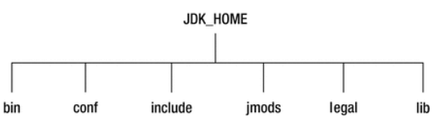
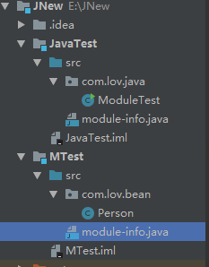
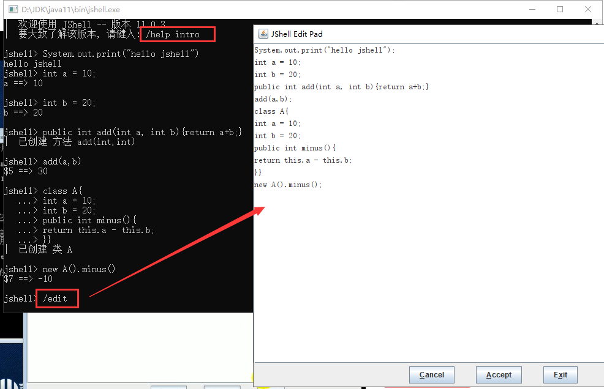
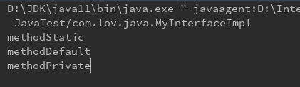
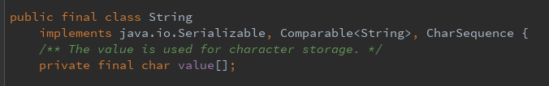
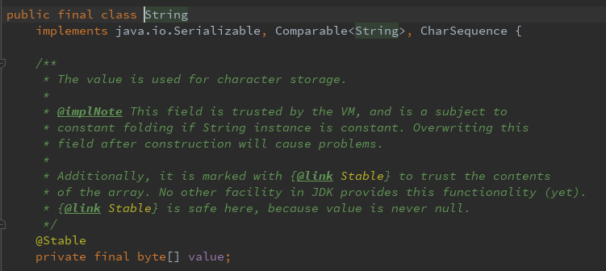
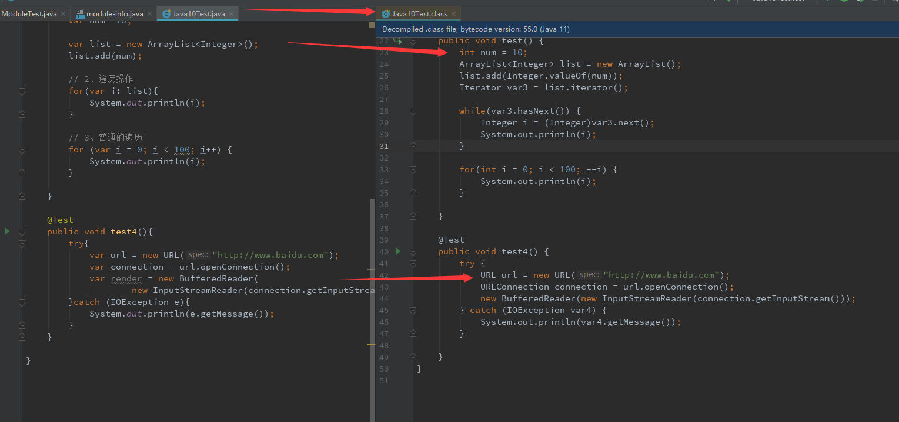

# Java9-11

## Java9

> **模块化系统**
> **jShell 命令**
> **多版本兼容 jar 包**
> **接口的私有方法**
> **钻石操作符的使用升级**
> **语法改进：try 语句**
> **下划线使用限制**
> **String 存储结构变更**
> **便利的集合特性：of()**
> **增强的 Stream API**
> **多分辨率图像 API**
> **全新的 HTTP 客户端 API**
> **Deprecated 的相关 API**
> **智能 Java 编译工具**
> **统一的 JVM 日志系统**
> **javadoc 的 HTML 5 支持**
> **Javascript 引擎升级：Nashorn**
> **java 的动态编译器**

### 目录层级 



*没有jre子目录*

| bin     | 包含所有命令                                                 |
| ------- | ------------------------------------------------------------ |
| conf    | 包含用户可比编辑的配置文件                                   |
| include | 包含编译本地代码时使用的c/c++头文件                          |
| jmods   | 包含JMOD格式的平台模块，创建自定义运行时镜像时需要。只存在与JDK中 |
| legal   | 包含法律声明                                                 |
| lib     | 包含非win平台的动态链接本地库                                |

### 模块化系统

​	(Jigsaw -> Modularity)

#### 产生意义

- **Java 运行环境的膨胀和臃肿**。每次JVM启动的时候，**至少会有30～60MB的内存加载，主要原因是JVM需要加载rt.jar**，不管其中的类是否被classloader加载，第一步整个jar都会被JVM加载到内存当中去（而**模块化可以根据模块的需要加载程序运行**
  **需要的class**）
- 当代码库越来越大，创建复杂，盘根错节的“意大利面条式代码”的几率呈指数级的增长。**不同版本的类库交叉依赖**导致让人头疼的问题，这些都**阻碍了 Java 开发和运行效率的提升**。
- **很难真正地对代码进行封装,** 而系统并没有对不同部分（也就是 JAR 文件）之间的依赖关系有个明确的概念。每一个公共类都可以被类路径之下任何其它的公共类所访问到，这样就会导致无意中使用了并不想被公开访问的 API。
- 由于**兼容性等各方面的掣肘**，对 Java 进行大刀阔斧的革新越来越困难，Jigsaw 从 Java 7 阶段就开始筹备，Java 8 阶段进行了大量工作，终于在 Java 9 里落地
- **Jigsaw项目（后期更名为Modularity）的工作量和难度大大超出了*
  **初始规划**。JSR 376 Java 平台模块化系统（JPMS, Java PlatformModule System）作为 Jigsaw 项目的核心, 其主体部分被**分解成****6 个 JEP**(JDK Enhancement Proposals)。
- 作为java 9 平台**最大的一个特性**，随着 Java 平台模块化系统的落地，开发人员无需再为不断膨胀的 Java 平台苦恼，例如，您可以**使用 jlink 工具，根据需要定制运行时环境**。这对于拥有大量镜像的容器应用场景或复杂依赖关系的大型应用等，都具有非常重要的意义
- ==本质上讲，模块(module)的概念，其实就是package外再裹一层==，也就是说，用模块来管理各个package，通过声明某个package暴露，不声明默认就是隐藏。因此，模块化使得代码组织上更安全，因为它可以指定哪些部分可以暴露，哪些部分隐藏。

#### 实现目标

- 主要目的在于减少内存的开销
- 只须必要模块，而非全部jdk模块，可简化各种类库和大型应用的
  开发和维护
- 改进 Java SE 平台，使其可以适应不同大小的计算设备
- 改进其安全性，可维护性，提高性能

#### 实现

1、目录结构，新建两个module，里面的包名不能一样



2、ModuleTest中引用Person类，分别在两个module的src文件下新建`module-info.java`

MTest/src/module-info.java

```java
module MTest {
	// exports：控制着哪些包可以被其它模块访问到。所有不被导出的包默认都被封装在模块里面。
    exports com.lov.bean;

}
```

JavaTest/src/module-info.java

```java
module JavaTest {
	//	指明对其它模块的依赖
    requires MTest;

}
```

3、引入使用

```java
package com.lov.java;

import com.lov.bean.Person;

public class ModuleTest {

    public static void main(String[] args) {
        Person person = new Person("lov", 12);
        System.out.println(person);
    }

}
```

### REPL工具

​	(Read Eval Print Loop:交互式解释器)

#### 基本使用



> |  /list [<名称或 id>|-all|-start]
> |       列出您键入的源
> |  /edit <名称或 id>
> |       编辑源条目
> |  /drop <名称或 id>
> |       删除源条目
> |  /save [-all|-history|-start] <文件>
> |       将片段源保存到文件
> |  /open  \<file>
> |       打开文件作为源输入
> |  /vars [<名称或 id>|-all|-start]
> |       列出已声明变量及其值
> |  /methods [<名称或 id>|-all|-start]
> |       列出已声明方法及其签名
> |  /types [<名称或 id>|-all|-start]
> |       列出类型声明
> |  /imports
> |       列出导入的项
> |  /exit [\<integer-expression-snippet>]
> |       退出 jshell 工具
> |  /env [-class-path <路径>] [-module-path <路径>] [-add-modules <模块>] ...
> |       查看或更改评估上下文
> |  /reset [-class-path <路径>] [-module-path <路径>] [-add-modules <模块>]...
> |       重置 jshell 工具
> |  /reload [-restore] [-quiet] [-class-path <路径>] [-module-path <路径>]...
> |       重置和重放相关历史记录 -- 当前历史记录或上一个历史记录 (-restore)
> |  /history [-all]
> |       您键入的内容的历史记录

==没有编译时异常，不需要显示捕获，jshell在后台将异常隐藏了==

### 接口的私有方法

MyInterface.java

```java
public interface MyInterface {

    void methodAbstract();

    static void methodStatic(){
        System.out.println("methodStatic");
    }

    default void methodDefault(){
        System.out.println("methodDefault");
        methodPrivate();
    }

    /**
     *  java9 中运行接口定义私有的方法
     */
    private void methodPrivate(){
        System.out.println("methodPrivate");
    }
}
```

MyInterfaceImpl.java

```java
public class MyInterfaceImpl implements  MyInterface {
    @Override
    public void methodAbstract() {

    }

   /* @Override
    public void methodDefault() {

    }*/

    public static void main(String[] args) {

        MyInterface.methodStatic();

        new MyInterfaceImpl().methodDefault();

    }
}
```



### 钻石操作符升级

​	与匿名实现类共同使用钻石操作符时，可以不带泛型名称，会自动推断类型

```java
@Test
    public void test(){
        Comparable<Object> com = new Comparable<>() {
            @Override
            public int compareTo(Object o) {
                return 0;
            }
        };
    }
```

### try语句

​	之前的try-with-resource必须在`()`中声明`Closeable`变量，现在可在外部声明

​	在外边声明后，`Closeable`变量为常量（final），不能修改

​	多个变量用`;`隔开

```java
public static void main(String[] args) {
        InputStreamReader in = new InputStreamReader(System.in);

        try(in){
            char[] chars = new char[20];
            int len;
            if ((len = in.read(chars)) != -1){
                String str = new String(chars, 0, len);
                System.out.println(str);
            }
        } catch (IOException e) {
            e.printStackTrace();
        }
    }
```

### String存储结构变更

>**Motivation**
>The current implementation of the String class stores characters in
>a char array, using two bytes (sixteen bits) for each character. Data
>gathered from many different applications indicates that strings are a
>major component of heap usage and, moreover, that most String
>objects contain only Latin-1 characters. Such characters require only
>one byte of storage, hence half of the space in the internal char arrays
>of such String objects is going unused.

**char数组造成存储空间浪费**

>**Description**
>We propose to change the internal representation of the String class
>from a UTF-16 char array to a byte array plus an encoding-flag
>field. The new String class will store characters encoded either as
>ISO-8859-1/Latin-1 (one byte per character), or as UTF-16 (two bytes
>per character), based upon the contents of the string. The encoding
>flag will indicate which encoding is used.

**将utf-16编码的char数组存储，转换为根据字符编码判断的byte数组**

java-old-String



java-9-String



==*与String相关的类都有相应的变化*==

### 集合工厂方法

​	**快速创建只读集合**

older：

​	要创建一个只读，不可改变的集合，必须构造和分配它，然后添加元素，最后包装为一个不可修改的集合

```java
		List<String> list = new ArrayList<>();
        list.add("lov1");
        list.add("lov2");
        list.add("lov3");

        list = Collections.unmodifiableList(list);
        System.out.println(list);

        list = Collections.unmodifiableList(Arrays.asList("a","b","c"));
        System.out.println(list);

        list = Arrays.asList("11","22","33");
        System.out.println(list);
```

java-9:

```java
//        java-9， 快速创建只读集合
        List<String> list1 = List.of("1","2","3");
//        list1.add("4");
        System.out.println(list1);

        Set<Integer> set = Set.of(1,2,3,4,5);

        Map<String, Integer> map = Map.of("k1",1,"k2",2,"k3",3);

        Map<String, Integer> map1 = Map.ofEntries(Map.entry("k1", 1),Map.entry("k2", 2), Map.entry("k3", 3));
```

### InputStream加强

​		InputStream新增非常有用的方法：`transferTo`，可以将数据直接传输到OutputStream

```java
	/**
     * InputStream 新方法： transferTo
     */
    @Test
    public void test3(){
        ClassLoader classLoader = this.getClass().getClassLoader();
        try(InputStream in = classLoader.getResourceAsStream("test.txt");)	{
            OutputStream out = new FileOutputStream("src/test_1.txt");
            // 将输入流所有数据直接复制到输出流
            in.transferTo(out);
        } catch (IOException e) {
            e.printStackTrace();
        }
    }
```

### 增强StreamAPI

​	Stream API 变得更好，Stream 接口中添加了 4 个新的方法：**dropWhile, takeWhile, ofNullable，还有个 iterate 方法的新重载方法**，可以让你提供一个 Predicate (判断条件)来指定什么时候结束迭代

​	除了对 Stream 本身的扩展，Optional 和 Stream 之间的结合也得到了改进。现在可以通过 **Optional 的新方法 stream() 将一个Optional 对象转换为一个(可能是空的) Stream 对象**

```java
	/**
     * StreamAPI 加强
     */
    @Test
    public void test4(){
        // 1 ------------------------------------------
        List<Integer> list = Arrays.asList(23,1,212,12,54,677,9,32);
        // 用于从 Stream 中获取一部分数据，接收一个 Predicate 来进行选择。在有序的Stream 中，takeWhile 返回从开头开始的尽量多的元素。
        list.stream().takeWhile(x -> x< 40).forEach(System.out::println);

        // 2 ------------------------------------------
        // dropWhile 的行为与 takeWhile 相反，返回剩余的元素
        list.stream().dropWhile(x -> x< 40).forEach(System.out::println);

        // 3 ------------------------------------------
        // Java 8 中 Stream 不能完全为 null，否则会报空指针异常。而 Java 9 中的ofNullable 方法允许我们创建一个单元素 Stream，可以包含一个非空元素，也可以创建一个空 Stream
        //报 NullPointerException
        //Stream<Object> stream1 = Stream.of(null);
        //System.out.println(stream1.count());
        //ofNullable()：允许值为 null
        Stream<Integer> stream = Stream.ofNullable(null);
        System.out.println(stream.count());

        // 4 ------------------------------------------
        // java8 中，iterate会创建无限流，不加limit会无限制的输出
        Stream.iterate(0, x-> x+1).limit(10).forEach(System.out::println);
        // java9中新增的重载的方法
        Stream.iterate(0, x->x<10, x-> x+1).forEach(System.out::println);
    }
```

### Optional获取Stream的方法

​	Optional类中stream()使用

```java
	/**
     * Optional : stream()
     */
    @Test
    public void test5(){
        List<Integer> list = Arrays.asList(1,2,3,4,5,6);

        Optional<List<Integer>> opt = Optional.ofNullable(list);
        Stream<List<Integer>> stream = opt.stream();
        stream.flatMap(x -> x.stream()).forEach(System.out::println);
    }
```

### Javascript 引擎升级：Nashorn

​	Nashorn 项目在 JDK 9 中得到改进，它为 Java 提供轻量级的
Javascript 运行时。Nashorn 项目跟随 Netscape 的 Rhino 项目，目
的是为了在 Java 中实现一个高性能但轻量级的 Javascript 运行时。
Nashorn 项目使得 Java 应用能够嵌入 Javascript。它在 JDK 8 中为
Java 提供一个 Javascript 引擎

​	JDK 9 包含一个用来解析 Nashorn 的 ECMAScript 语法树的
API。这个 API 使得 IDE 和服务端框架不需要依赖 Nashorn 项目的
内部实现类，就能够分析 ECMAScript 代码

## Java10

### 局部变量的类型推断	

```java
	/**
     * 局部变量的类型推断
     */
    @Test
    public void test(){
        // 1、声明变量，根据值推断变量类型
        var num= 10;

        var list = new ArrayList<Integer>();
        list.add(num);

        // 2、遍历操作
        for(var i: list){
            System.out.println(i);
        }

        // 3、普通的遍历
        for (var i = 0; i < 100; i++) {
            System.out.println(i);
        }
        
        // ------正常使用
        try{
            var url = new URL("http://www.baidu.com");
            var connection = url.openConnection();
            var render = new BufferedReader(
                    new InputStreamReader(connection.getInputStream()));
        }catch (IOException e){
            System.out.println(e.getMessage());
        }

    }
```

==以下情况不能使用：==

> - 初始值为null `var num = null;`
> - 方法引用`var con = System.out::println;`
> - lambda表达式`var sup = ()->Math.random();`
> - 为数组静态初始化`var arr = {1,2,3,5}`
> - 没有初始化的局部变量声明
> - 方法的返回类型
> - 方法的参数类型
> - 属性
> - catch块 `......}catch(var e){....}`

#### 原理

​	==在处理var时，编译器先查看表达式右边部分，并根据右边变量值的类型进行推断，作为左边变量的类型，然后将该类型写入字节码当中==

​	var不是关键字，就是一个普通合法的标识符（除了不能为类名，其他都可以）



### 新增创建不可变集合方法

```java
	/**
     * 集合中新增的copyOf(),用于创建一个只读集合
     */
    @Test
    public void test2(){
        var list1 = List.of("1","2","3","4");
        var copy1 = List.copyOf(list1);
        System.out.println(list1 == copy1);
        // true

        var list2 = new ArrayList<String>();
        var copy2 = List.copyOf(list2);
        System.out.println(list2 == copy2);
        // false
    }
```

==如果参数本身为只读集合，copyOf直接返回该结合；若不是只读，返回一个新的只读集合==

## Java11 

### String新增方法

| 描述                 | 例子                             |
| -------------------- | -------------------------------- |
| 判断字符串是否为空白 | `"".isBlank()`                   |
| 去除首位空白         | `"  aa  ".strip()`               |
| 去除尾部空白         | `"aa ".stripTrailing()`          |
| 去除首部空白         | `" aa".stripLeading()`           |
| 复制字符串           | `"aa".repeat(3)`                 |
| 行数统计             | `"aa\nbb\ncc\n".lines().count()` |

```java
	/**
     * String 新增方法
     */
    @Test
    public void test(){
        System.out.println(" \t \t \n ".isBlank());
        System.out.println("==="+ "  \t abc \t \n".stripTrailing()+ "===");
        System.out.println("abc".repeat(3));
        System.out.println("aa\nbb\ncc\n".lines().count());
    }
```

### Optional新增方法

​	可以很方便将一个Optional转换为一个Stream，或当一个空Optional时给它一个替代

| 新增            | 描述                                                       | 新增版本 |
| --------------- | ---------------------------------------------------------- | -------- |
| isEmpty()       | 判断value是否为空                                          | 11       |
| ifPresentOrElse | value非空，执行参数1，否则执行参数2                        | 9        |
| or              | value非空，返回对应Optional，否则返回形参封装的Optional    | 9        |
| stream()        | value非空，返回仅包含此value的Stream，否则返回一个空Stream | 9        |
| orElseThrow()   | value非空，返回value，否则抛出异常NoSuchElementException   | 10       |

```java
	/**
     * Optional 新增方法
     */
    @Test
    public void test1(){
        Optional<Object> op = Optional.empty();
        System.out.println(op.isPresent());
        System.out.println(op.isEmpty());

        op = Optional.of("abc");
        var obj = op.orElseThrow();
        System.out.println(obj);

        Optional<String> op1 =  Optional.of("hello");
        // or: value非空，返回对应的Optional；否则返回封装的Optional
        Optional<Object> op2 = op.or(()-> op1);
        System.out.println(op2);
    }
```

### 局部变量类型推断的升级

​	在var上添加注解的语法格式，在jdk10是不能实现的。jdk11加入该语法

```java
	/**
     * 局部变量类型推断升级
     */
    @Test
    public void test2(){

        //jdk10
        Consumer<String> con1 = (@Deprecated String t)->System.out.println(t.toUpperCase());

        //jdk11
        Consumer<String> con2 = (@Deprecated var t)->System.out.println(t.toUpperCase());

    }
```

### HttpClient

​	替代仅适用于 blocking 模式的HttpURLConnection （HttpURLConnection是在HTTP 1.0的时代创建的，并使用了协议无关的方法），并提供对 WebSocket 和 HTTP/2 的支持

```java
	/**
     * HttpClient 替换原有 HttpURLConnection
     *
     * 另有异步请求方式
     */
    @Test
    public void test3() {
        try {
            HttpClient client = HttpClient.newHttpClient();
            HttpRequest request = HttpRequest.newBuilder(URI.create("http://www.baidu.com")).build();
            HttpResponse.BodyHandler<String> bodyHandler = HttpResponse.BodyHandlers.ofString();
            HttpResponse<String> response = client.send(request, bodyHandler);

            String body = response.body();
            System.out.println(body);
        } catch (IOException e) {
            e.printStackTrace();
        } catch (InterruptedException e) {
            e.printStackTrace();
        }

    }	
```

### 更简化的编译运行程序

​	java11 中编译运行只需要一个java命令 ：`java hello.java`

**该方式注意点：**

- 执行源文件中的第一个类，第一个类必须包含main方法
- 不可用使用其他源文件中的自定义类，同文件中自定义类可以使用

### 其他新特性

- 废弃Nashorn引擎

- ZGC

  > ​	ZGC是一个并发，基于region，压缩型的垃圾收集器，只有root扫描阶段会STW（stop the world），因此GC停顿时间不会随着堆的增长和存活对象的增长而变长
  >
  > 优势：
  >
  > - GC暂停时间不会超过10ms
  > - 既能处理几百兆的小堆，也能处理几个T的大堆（OMG）
  > - 和G1相比，应用吞吐能力不会下降超过15%
  > - 为未来的GC功能和利用colord指针以及Load barriers优化奠定基础
  > - 初始只支持64位系统

- 新的Epsilon垃圾收集器

- 支持G1上并行完全垃圾收集

- Java Flight Recorder


